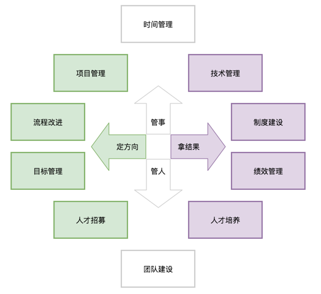

# [优秀的技术Leader“图谱”](http://www.sohu.com/a/280416703_463994)

## 维度
* 从管事到管人 

* 从定方向到拿结果 

## 模块
* [时间管理](Time-Mgt.md)
* [项目管理](PM.md)
* [技术管理](Technological-Mgt.md)
* [流程改进](Process-improvement.md)
* [制度建设](institutional-construction.md)
* [目标管理](MBO.md)
* [绩效管理](Performance-Mgt.md)
* [人才招募](Recruitment.md)
* [人才培养](talent-training.md)
* [团队建设](Team-Building.md)
