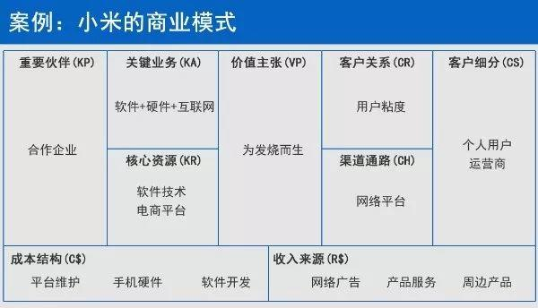

# 商业模式画布

是一个结构化的思考工具，包括9个构造块。



## 前端系统

### 客户群体（Customer Segments） - 明确的目标客户群意识
目标用户群体是谁？

### 价值主张（Value Propositions） - 给一个客户使用或购买你们公司产品的理由
为用户和客户提供什么产品和服务以及价值，帮助用户解决什么根本性问题？

### 渠道通路CH - 你的产品最终是怎么达到用户
通过什么方式和途径将产品和服务触达用户，并使得用户能够为之买单？

### 客户关系（Customer Relationships） - 和用户之间搭建怎样的关系
通过什么方式或机制可以保证产品服务和用户拥有长期的利益关系？

### 收入来源（Revenue Streams） - 商业模式从哪几个方式来赚钱
我们的主要收入来源是什么？

## 后端系统

### 关键活动（Key Activities） - 进行哪些经营活动让商业模式有效运转起来
需要做哪些关键性的事情才能使得产品和服务能够正常运行？

### 关键资源（Key Resources） - 做好事情的独有资源
拥有什么核心资源可以保证所有商业行为的执行和落实？

### 关键合作伙伴（Key Partners） - 形成生态性、互相配合的圈子生意
需要和哪些上下游重要企业进行重度合作？

### 成本结构（Cost Structure） - 你怎么有效地花钱、如何花到合理之处
在所有的商业运作过程中都包含的成本消耗？

## 商业模式案例 - 小米
```text
客户细分：
    小米的客户分几大类：
    年轻人的大众市场；移动、联通、电信运营商的利基市场；
    提供商品给第三方平台或是供应商的平台式市场；开售手机周边商品的多元化市场。
价值主张：
    小米以为发烧而生的价值观来打造产品差异化、服务差异化、形象差异化。
渠道通路：
    小米以网络平台为主要渠道，还有可利用的合作伙伴的渠道。
客户关系：
    小米以社区方式为主，来提高用户粘性，除此以外还有个人助理、自动服务、专用个人助理、自动化服务。
收入来源：
    小米的收入来源有手机来源、周边产品、网络广告、软件服务、知识产权。
核心资源：
    实体资产、人力资源——知识产权、金融资产。
关键业务：
    铁人三项——硬件、软件、互联网服务。
重要伙伴：
    富士康、凡客诚品负责小米商城物流。
成本结构：
    平台维护 手机硬件 软件开发。
```

## 应用典型场景

* 新产品创意之前，或者上市之前
企业新产品要上市之前，或者在创意之前，用商业画布来规划新产品、规划商业模式。

* 对老产品进行复盘诊断、更新迭代
老产品的商业模式的迭代，因为很多时候很多公司的产品，推出之后市场反映都不好，那不好问题到底在哪儿，  
可以用商业画布对于老产品做一个复盘，做一个剖析和诊断。  
把各个部门叫到一起，通过思维碰撞，不断改善产品。

* 对标竞品
你可以想象成自己坐在竞争对手的办公室里面，用商业画布把竞品的商业模式做一个系统性的完整分析。

* 销售作战地图，争取产品大卖
举例，当那种全国性架构的企业定了其产品定位，那么其下属省级公司、地方公司对这个产品的改善已没有太多发言权，那这时间也就不要再讨论产品了。  
接下来的任务是什么呢？那就是思考“这个产品如何大卖”。

