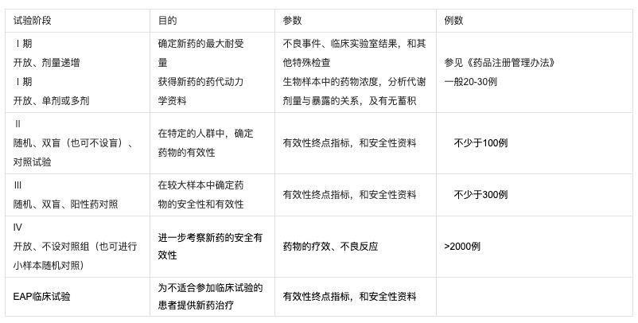
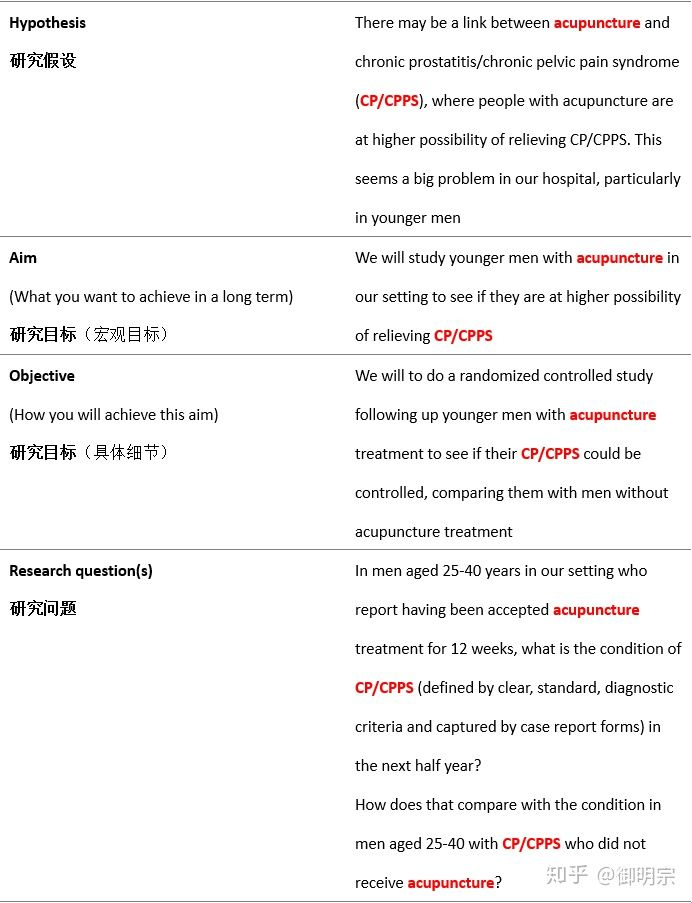

# Clinical Trial 临床试验 

* 先参考 [科学实验方法](https://github.com/SunnnyChan/sc.insights/tree/master/Methods/Trial)

## 阶段

### Ⅰ期临床试验

包括初步的临床药理学、人体安全性评价试验及药代动力学试验，为制定给药方案提供依据。  
包括：耐受性试验：初步了解试验药物对人体的安全性情况，观察人体对试验药物的耐受及不良反应。   
药代动力学试验：了解人体对试验药物的处置，即对试验药物的吸收、分布、代谢、消除等情况。  

### Ⅱ期临床试验  

治疗作用初步评价阶段。  
其目的是初步评价药物对目标适应症患者的治疗作用和安全性，也包括为III期临床试验研究设计和给药剂量方案的确定提供依据。  
此阶段的研究设计可以根据具体的研究目的，采用多种形式，包括随机盲法对照临床试验。  

Ⅱ期试验必须设对照组进行盲法随机对照试验，  
常采用双盲随机平行对照试验（Double-Blind, Randomized, Parallel Controlled ClinicalTrial）。

* * 双盲法试验  

申办者需提供外观、色香味均需一致的试验药与对照药，并只标明A药B药，试验者与受试者均不知A药与B药何者为试验药。  
如制备A、B两药无区别确有困难时，可采用双盲双模拟法（Double-Blind, Double Dummy Technique），  
即同时制备与A药一致的安慰剂（C），和与B药一致的安慰剂（D），  
两组病例随机分组，分别服用2种药，一组服A+D，另一组服B+C，两组之间所服药物的外观与色香味均无区别。

### Ⅲ期临床试验

治疗作用确证阶段。  
其目的是进一步验证药物对目标适应症患者的治疗作用和安全性，评价利益与风险关系，最终为药物注册申请的审查提供充分的依据。  
试验一般应为具有足够样本量的随机盲法对照试验。  

Ⅲ期临床试验中对照试验的设计要求原则上与Ⅱ期盲法随机对照试验相同，  
但Ⅲ期临床的对照试验可以设盲也可以不设盲进行随机对照开放试验（Randomized Controlled Open Labeled Clinical Trial）。  
某些药物类别，如心血管疾病药物往往既有近期试验目的如观察一定试验期内对血压血脂的影响，  
还有长期的试验目的如比较长期治疗后疾病的死亡率或严重并发症的发生率等，则Ⅲ期临床试验就不单是扩大Ⅱ期试验的病例数，  
还应根据长期试验的目的和要求进行详细的设计，并做出周密的安排，才能获得科学的结论。  

### Ⅳ期临床试验

IV期临床试验为新药上市后由申请人进行的应用研究阶段。  
其目的是考察在广泛使用条件下的药物的疗效和不良反应、评价在普通或者特殊人群中使用的利益与风险关系以及改进给药剂量等。  

### EAP临床试验  

（expanded access program），是指制药企业为了让患有严重疾病且不适合参加对照试验的患者，  
在特定的条件下，能够得到正处于临床试验阶段的研究新药的治疗，而开展的一类临床试验。  

  

## 设计

设计一个好的临床研究并不是一件容易的事情，对于随机对照试验来说，在试验开始之前需要进行大量的准备工作。  
设计临床研究方案需要团队合作，不同背景的专家进行讨论，不断完善才能最终启动一项研究。  

* CONSORT

临床试验报告的统一标准（CONsolidated Standards Of Reporting Trials，CONSORT）。  
它是随机对照试验的报告标准，  
有助于医务人员了解试验背景、原理、目的、研究人群、干预措施、随机方法、统计分析，  
有助于相关医务人员对试验的科学性和严谨性进行评估，  
有助于研究者提高临床研究设计水平。  

CONSORT声明的最终目的在于提高外部真实性、确保内部真实性和设计正确的随机对照试验方法以保证随机化。  

* 研究目标及研究假设  

任何研究在开始之前都需要有明确的研究目标和研究假设，随机对照试验也不例外。  
通常情况下随机对照试验的研究目标是评价某种干预措施的有效性和安全性。  
研究假设基于研究目标，假设是研究者对于结果的一种尝试性的猜测，但它的正确性犹未可知。  

要注意研究假设必须包含以下特征：  
单一性；  
可验证性；  
与已知知识有联系；  
以及可操作性。  

下表总结了研究目标、研究假设和研究问题。  

  

* 随机化方法    

包括产生随机分配序列的方法，分配隐藏的方法以及具体的实施过程。  

* 干预及对照的选择  

各个干预及对照组的详细内容以及何时、如何实施。  

* 样本量计算  

需要提供样本量计算的具体方法。  
由于样本量计算的公式复杂多样，目前有各种软件（如收费软件PASS、SAS中调用proc power语句等；免费软件WinPepi）可以方便准确的完成这一任务。  
但值得注意的是，在计算前研究者需要准备好所需的条件参数，包括预期疗效（组间差异），统计参数（显著性和把握度）。  
如使用了非劣效性设计、等效性设计、优效性设计，相应地还需提供计算样本量所需的界值。

* 结局指标的选择以及统计分析方法

明确定义主要和次要结局指标以及其测量时间和方法，对具体的结局指标选用的统计分析方法进行说明。  

小结：  

RCT作为一种行之有效的临床试验设计，在医学研究中有着不可替代的重要作用。  
医学的四大顶级杂志皆对大样本RCT青睐有加，循证医学也十分重视来自于高质量RCT的结论，并大量参考。  
但要注意无法保证正确、可靠的随机化和盲法的实施以及缺乏合适对照的低质量RCT的泛滥问题。  
此外，开展大样本RCT需要大量的人力、资金支持和长时间投入，研究者开展一项高质量的RCT会面临很多困难；  
RCT人群外推性常常受到限制也是它的局限性之一。  
