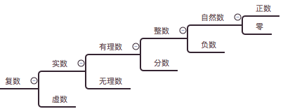

## 数的发展
> 概念的拓展
* 正数
```md
人类认识数字是从正整数开始的，因为接触到的世界就是一个接一个的实实在在的东西。
正整数的概念能根据生活经验形成。
```
* 自然数
```md
零的概念人类从有数字开始花了几千年时间才搞明白。
而在今天它是我们熟知的一个数学常识，由此可见常识是不断更新的。
有了零，人类对数字的认识就从正整数到了自然数。
```
* 负数
```md
有了数字就要做运算，事实上运算早于0出现。
最早的运算是加法，自然数对于加法来讲本身是完备的。（即两个自然数相加结果还是自然数）

有了加法就必然产生加法的概念。
对于减法，自然数就不完备了，于是人们发明了负数的概念。

如果把加法看成一个函数，那么2 - 3 其实已经是减法函数定义的一个延拓了，
因为这里减法的定义范围扩大到了负数。

当概念进行了延拓，数学就变得抽象了，难懂了，但是功能更强大了。
```
* 有理数
```md
和加法类似，自然数对于乘法来讲，也是完备的。
遗憾的是，自然数对出发不是完备的，因为 2/3 不是一个整数。于是人们有定义了分数的概念。
这样整数加上分数，就形成了有理数。
```
* 无理数
```md
乘法中有一类特殊的乘法，就是平方。有理数对于平方来讲，也是完备的。
当然人类很快想到平方的逆运算就是开方。遗憾的是，对于开方来说，有理数是不完备的。
像根号2这样的数不是有理数，于是无理数的存在被确认。
```
* 实数
```
从有理数到无理数，数的范围又进行了一次延伸，从有理数扩展到了实数。
即有理数和无理数的总称。开方运算也自然进行了一次延拓。
```
* 虚数
```md
有了实数的概念，开方对于正的实数来说是完备的。
但是对于负数来讲会有问题，因为没有一个实数的平方等于 -1，也就是-1的开方在实数中无定义。

于是，数学家不得不发明了一个虚拟的数字，让它的平方等于 -1，就是虚数 i。即 i  x i = -1。

虚数产生的不同
虚数出现的概念和前几次的数概念的拓展不同，因为它不是自然界本身存在的，
完全是数学家为了让开方运算完备而发明出来的。

这样的数学，已经完全是一个从定义和公理出发，通过逻辑推演出的知识体系了，
它已经无法和现实世界一一对应了。
从此，我们不能再用对现实世界的的理解，去判定数学上的对错了。
```
* 复数
```md
开方运算就被延拓到复数的范围，所谓复数是实数和虚数的总称。有了复数 加减乘除、平方、开方就完备了。

复数的作用
复数在现实世界中完全不存在，但它是一个非常强大的数学工具。
使用这个在现实生活中不具备事实基础的数学工具，可以解决很多现实世界的问题。
比如 三相交流电是实实在在存在的，它的很多问题，用复数解决要比实数加三角函数容易得多。
涉及电池波的几乎所有问题，都需要使用复数这个工具来解决。
```



> 总结
*
* "延拓"
```md
人类最初的认知来源于实践，但是人类渐渐发现很多新的问题在原有的认识基础上就无法解决了。
于是人类就进行概念的延拓，当然数学上也就有了运算（和函数）的延拓。

所以 每当我们发现问题的时候，其实都是我们的机会，而不是厄运。
数学就是在这样不断发现问题，解决问题的过程中进步的。
在生活中，适当的、合乎逻辑的“延拓”也是很重要的。
```
* “数学”
```md
数学是一个重要的工具，它的很多分支建立在“不存在”的基础上，却能解决现实的问题。
这在哲学意义上是一件很有意思的事情。

有效地做事情，掌握好的工具非常重要。
同一个问题有人因为手头上有好的工具，就解决了。
而有些人从自己的现实世界的经验出发慢慢摸索，就难以解决。
```