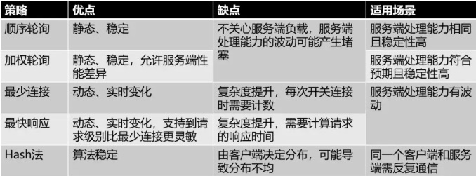
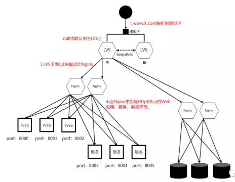

# Load Balancer Design

### 技术方案
#### 基于DNS负载均衡
```md
DNS 的本质是解决「domain name --> IP」。
DNS 的“智能解析”功能 可以做到 IP 的动态返回，起到了负载均衡的作用。

由于其本身是一个工作在 L3（网络层）的解决方案，所以无法对“端口”进行工作。
```
* 场景
```md
在DNS服务器解析域名的时候，根据不同地理位置的用户返回不同的IP。
相当于实现了按照「就近原则」将请求分流了，既减轻了单个集群的负载压力，也提升了用户的访问速度。
```
* 优势
```md
配置简单，实现成本非常低，无需额外的开发和维护工作。
```
* 缺点
```md
* 当配置修改后，生效不及时。
  DNS一般会有多级缓存，所以当我们修改了DNS配置之后，
  由于缓存的原因，会导致IP变更不及时，从而影响负载均衡的效果。

* 大多是基于地域或者干脆直接做IP轮询，没有更高级的路由策略。
```
#### 基于硬件负载均衡
```md
能够同时支持 L2~L7 的转发。
如果在经济允许的情况下，直接上 F5 能解决很多原本需要花更多时间去解决的问题。
```
*  F5 Network Big-IP

#### 基于软件负载均衡
```md
指使用软件的方式来分发和均衡流量，分为7层协议 和 4层协议。
```
* L7
```md
基于第七层应用层来做流量分发的称为7层负载均衡。

最大的特点就是灵活，请求的 URL、Header 都是我们可以掌控的，
所以我们可以利用其中的任何信息为负载均衡策略所用
```
> Nginx 反向代理。
* L4
```md
基于第四层传输层来做流量分发的方案称为4层负载均衡。

当「Web 应用」所依赖的 TCP 协议的「服务」需要横向扩展，
或者需要做「数据库」、「分布式缓存」的多主、主从集群时。
```
> [LVS](implement/LVS.md)

### 转发策略
#### 轮询策略
* 顺序轮询
```md
在DNS方案中用的比较多，无需关注后端服务的状态。
```
* 随机轮询
* 加权轮询

#### 负载度策略
```md
充分的结合了后端服务器的运行状态，来动态的分配流量了，比轮询的方式更为科学一些。
这种方式带来了效果优势的同时，也增加了「负载均衡器」的实现难度和维护成本。
```
* 连接数
* 请求数
* CPU负载指标
* IO负载指标

#### 响应策略
* 最快响应
```md
需要「负载均衡器」不停的去统计每一台后端服务器对请求的处理速度。
```
#### 哈希策略
```md
结果是由客户端决定的，通过客户端带来的某个标识经过一个标准化的散列函数进行打散分摊。
```
* Hash 一致性

#### 其它
```md
想要更优的效果，必然就需要更高的复杂度。
比如，可以将简单的策略组合使用、或者通过更多维度的数据采样来综合评估，
甚至是基于进行数据挖掘后的预测算法来做
```


### 应用实践

* 利用DNS 的域名解析所带的负载均衡效果
```md
只要复制多套 LVS 主备出来，绑上多个不同的虚 IP。可以做到无限横向扩展，以支撑不断增长的流量。
```
* LVS+Keepalived 负责做 Nginx 的负载均衡
* Nginx 负责分发实际的请求到 HTTP 和 TCP 协议的应用上
	