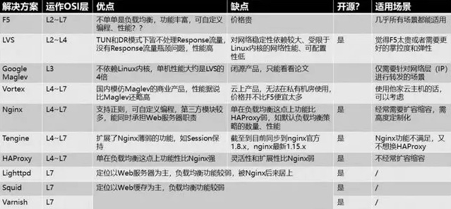

# Load Balancer Implement

*  F5 Network Big-IP (L2-L7)
```md
是一个网络设备，完全通过硬件来抗压力，性能是非常的好，
每秒能处理的请求数达到百万级，即 几百万/秒 的负载，
当然价格也就非常非常贵了，十几万到上百万人民币都有。

负载均衡的算法支持很多灵活的策略，同时还具有一些防火墙等安全功能。
```
```md
一般用在大型互联网公司的流量入口最前端，以及政府、国企等不缺钱企业会去使用。
```
* [LVS](implement/LVS.md) (L2-L4)
* Google Maglev (L3)
* Vortex (L4-L7)
* Nginx (L4-L7)
* Tengine (L4-L7)
* HAProxy (L4-L7)
* Lighttpd (L7)
* Squid (L7)
* Varish (L7)

* Service Mesh 
```md
云时代 Service Mesh 风兴起，以 Sidecar 模式为核心的后起之秀 
Linkerd、Conduit、NginMesh、Istio 等软件除了满足负载均衡之外，
还为高可用相关的做了众多的考量。
```

## 总结
